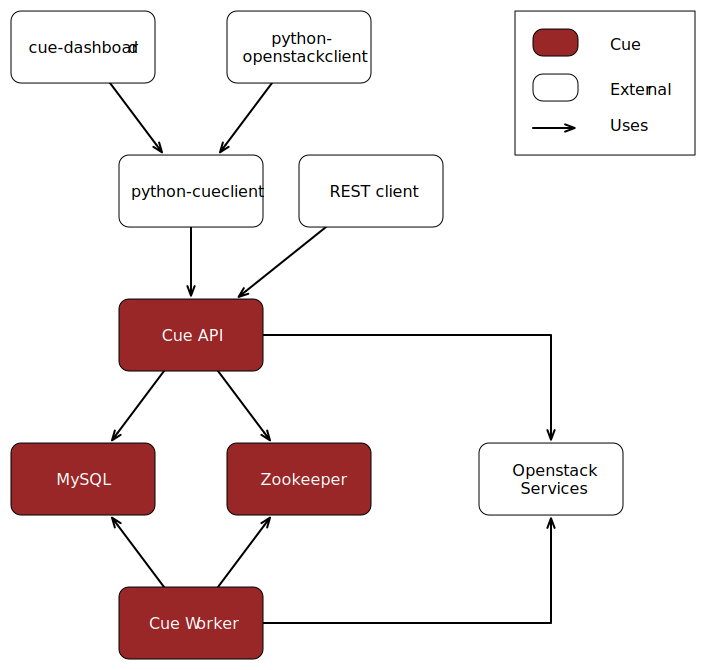

.. _install-ubuntu-architecture:

Architecture
============

Installation of Cue requires four (2) primary Cue components, two (2)
components that are external dependencies for Cue, and three (3) optional
components.

Required Cue Components
^^^^^^^^^^^^^^^^^^^^^^^

* Cue API
* Cue Worker

Required Dependencies
^^^^^^^^^^^^^^^^^^^^^

* MySQL
* Zookeeper

Optional Components
^^^^^^^^^^^^^^^^^^^

* Cue Command-line Client (python-cueclient)
* Cue Dashboard (cue-dashboard)
* Openstack Client (python-openstackclient)

Additional Setup
^^^^^^^^^^^^^^^^

Additional setup beyond installing Cue services is required in Keystone to
allow authentication of user credentials against Keystone.  Also the Keystone
service catalog must be updated to include Cue's service endpoints.

