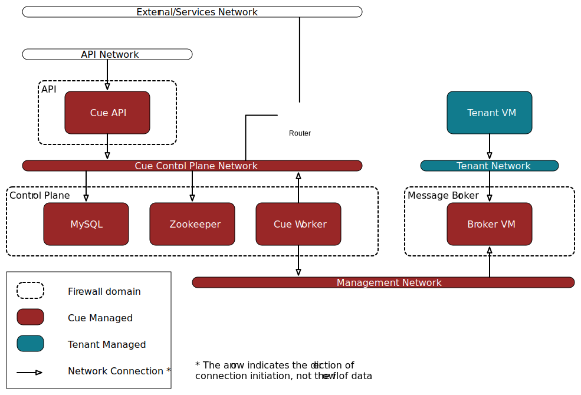

**********************
Recommended Deployment
**********************

.. _recommended-deployment-overview:

Overview
========

Cue currently does not support creation of broker VMs in user tenants.  This is
to ensure the overall security of Cue in a multi-tenant environment as well as
to prevent direct modification of Broker VMs by tenants.  Cue is a full life
cycle management solution for Message Brokers, therefore it requires final
control over the Broker VMs.

Cue can be installed in a very flat network with all components and interfaces
existing in a single network plane.  However, for the sake of security and
isolation, it is recommended that separate networks and firewall domains/zones
be created.  Below is a diagram showing the currently recommended deployment
model.

.. _recommended-deployment-network:

Networks
^^^^^^^^

* API Network - This is the network that the Cue API will expose its API
  endpoint to.  This network will need to be routable/reachable by all Cue
  users and will likely need to be a "public" network.
* Cue Control Plane Network - This is the network that all Cue Control Plane
  components (API, MySQL, Zookeeper, Worker) will use to communicate with each
  other.  It is recommended this network be isolated from all other traffic.
  This network can optionally be connected to a "service" network that provides
  access to shared services like monitoring.
* Management Network - This is the network that the Cue Worker and all Broker
  VMs attach to.  The Cue Worker connects to Broker VMs through the management
  network to monitor and control each Broker VM.
* Tenant Network - The tenant network is not a single network, it is any
  network that the Cue user specifies.  Cue creates and attaches a port from
  the tenant network to the Broker VM in order to provide access to Message
  Broker services.
* External/Services Network - This is a network that the Cue Control Plane
  might optionally be attached to.  This network, if attached to the Cue
  Control Plane, should be isolated from Tenant/User traffic in order to
  prevent possible attacks to the Cue Control Plane.

.. _recommended-deployment-security-groups:

Security Groups
^^^^^^^^^^^^^^^

All security groups should have a default deny policy and allow only the
specific ports as specified below:

* API - The API listens on the Cue service port (8795 by default) and must
  allow incoming requests to this port from the API network.
* Control Plane - The Cue API and Cue Worker access MySQL and Zookeeper for
  persisting data and coordination.  It is highly recommended that MySQL and
  Zookeeper both be clustered, which requires that respective clustering ports
  be opened to members of each respective cluster.  If the firewall is
  implemented with Security Groups, a group rule can be used to allow access to
  all members of the control plane, or explicit rules can be used to limit
  access to specific ports.
* Message Broker Internal - There exists a unique "Message Broker Internal"
  security domain/zone for each Message Broker type that is supported by Cue.
  The Message Broker VM must allow access from Cue Worker in order to allow Cue
  to manage the Message Broker VM.  Depending on the Message Broker, it will
  also need to allow cluster traffic between the Message Broker VMs to
  facilitate clustering.
* Message Broker Public - There exists a unique "Message Broker Public"
  security domain/zone for each Message Broker type that is supported by Cue.
  The Message Broker VM must allow access to the public endpoints for the
  Message Broker service it is providing.

.. _recommended-deployment-cue-tenant:

Cue Tenant and Users
^^^^^^^^^^^^^^^^^^^^

Cue requires its own Tenant, which is used to create all Broker VMs.

Cue uses two logically separate users to interact with Openstack:

* Cue Service User
* Cue Tenant User

Cue Service User is used by Cue API to communicate with Keystone for
authenticating user tokens.  The Cue Service User must have an appropriate
Keystone role to be able to authenticate Keystone auth tokens.

Cue Tenant User is used by Cue Worker to communicate with Openstack services
like nova, neutron, and cinder, to create and manage Broker VMs.  The Cue
Tenant User must have appropriate access to the Cue Tenant for creating VMs.
The Cue Tenant User must also have an appropriate neutron role to be able to
create ports on networks not owned by the Cue Tenant.

It is also recommended that the Cue Tenant User has appropriate quotas set for
Nova, Cinder, and Neutron. These settings reflect the capacity available to Cue
for provisioning Broker Clusters.
